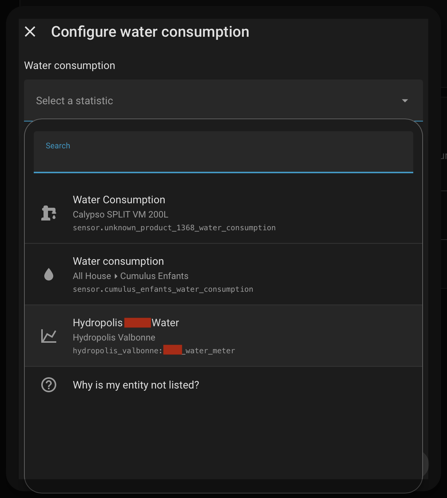

# Hydropolis Valbonne


[](https://github.com/hacs/integration)


A [Home Assistant](https://www.home-assistant.io/) custom component to monitor water consumption from [SPL Hydropolis](https://www.hydropolis-sophia.fr/), the water utility serving Valbonne and the Sophia Antipolis area in France.

## Features

- Fetches daily water meter readings from the Hydropolis subscriber portal
- Creates a water meter sensor showing total consumption in liters
- Imports full historical data into Home Assistant long-term statistics
- Integrates with the **Energy dashboard** (water consumption section)
- Automatic incremental updates every 12 hours

## Installation

### HACS (recommended)

1. Install [HACS](https://hacs.xyz/) if you haven't already.
2. Click the button below to add this repository to HACS:

   [](https://my.home-assistant.io/redirect/hacs_repository/?owner=tmenguy&repository=hacs-hydropolis-valbonne&category=integration)

   Alternatively, in Home Assistant go to **HACS > Integrations**, click the three-dot menu in the top-right corner, select **Custom repositories**, and add `https://github.com/tmenguy/hacs-hydropolis-valbonne` with category **Integration**.

3. Search for **Hydropolis Valbonne** and click **Download**.
4. Restart Home Assistant.

### Manual installation

1. Copy the `custom_components/hydropolis_valbonne` folder into your Home Assistant `config/custom_components/` directory.
2. Restart Home Assistant.

## Configuration

The integration is configured entirely through the UI.

1. Click the button below (or go to **Settings > Devices & Services > Add Integration** and search for **Hydropolis Valbonne**):

   [](https://my.home-assistant.io/redirect/config_flow_start/?domain=hydropolis_valbonne)

2. Enter your Hydropolis subscriber portal **email** and **password** (the same credentials you use on [hydropolis-sophia.fr](https://www.hydropolis-sophia.fr/)).
3. If your account has multiple water contracts, select the one you want to monitor.

On first setup, the integration pulls all available history (up to several years) from the Hydropolis API. This may take a moment depending on the amount of data.

## Energy Dashboard -- Water Consumption

This integration is designed to work with Home Assistant's [Energy dashboard](https://www.home-assistant.io/docs/energy/). To add your water consumption:

1. Go to **Settings > Dashboards > Energy**, or click:

   [](https://my.home-assistant.io/redirect/config_energy/)

2. Scroll to the **Water consumption** section and click **Add water source**.
3. In the entity picker dropdown, you need to pick a **statistic** (not an entity). Type `hydropolis` to filter, and select the statistic named **Hydropolis _your-contract-id_ Water**.

   > **Important:** Do not select the sensor entity directly. You must select the *statistic* entry which has the id `hydropolis_valbonne:<contrat_id>_water_meter`. See the screenshot below.

   

4. Click **Save**.

Water consumption data will now appear in your Energy dashboard.

## Technical Notes

### Data is delayed -- this is normal

Hydropolis meter readings are **not real-time**. The data typically lags **2 to 5 days** behind the current date. This is an inherent limitation of how smart water meters report to the Hydropolis platform, not a bug in this integration. The integration checks for new data every 12 hours.

### Why the sensor has no `state_class`

You may notice that the water meter sensor does not have a `state_class` attribute. This is intentional.

Home Assistant's recorder automatically generates long-term statistics for sensors that declare a `state_class`. However, because Hydropolis data arrives in delayed daily batches (not as real-time state changes), auto-generated statistics would be inaccurate and would conflict with the correct historical data.

Instead, this integration uses Home Assistant's **external statistics** mechanism (`async_add_external_statistics`) to import daily meter index values directly into the long-term statistics database. This is the same approach used by official integrations that deal with historical utility data. The Energy dashboard picks up these external statistics seamlessly.

### Statistic ID

The statistic ID used by the integration follows the format:

```
hydropolis_valbonne:<contrat_id>_water_meter
```

This is what you select in the Energy dashboard picker. You can also find it under **Developer Tools > Statistics**.

## Troubleshooting

### Enable debug logging

To get detailed logs, call the `logger.set_level` service:

```yaml
service: logger.set_level
data:
  custom_components.hydropolis_valbonne: debug
```

Or add the following to your `configuration.yaml` and restart:

```yaml
logger:
  logs:
    custom_components.hydropolis_valbonne: debug
```

### Common issues

| Problem | Cause / Solution |
|---|---|
| "Invalid email or password" | Double-check your Hydropolis portal credentials at [hydropolis-sophia.fr](https://www.hydropolis-sophia.fr/) |
| "No water contracts found" | Your account may not have an active contract, or the Hydropolis API may be temporarily unavailable |
| No data in Energy dashboard | Data takes a few days to appear initially. Make sure you selected the *statistic* (not the entity) in the Energy dashboard configuration |
| Values seem outdated | This is expected -- see [Data is delayed](#data-is-delayed----this-is-normal) above |

## License

This project is licensed under the [GNU General Public License v3.0](LICENSE).

## Credits

Data provided by [SPL Hydropolis](https://www.hydropolis-sophia.fr/).

If you use it ... it means you live in our beautiful Valbonne area, so if you want to buy me a coffee, let's do so in real life and get in touch!
