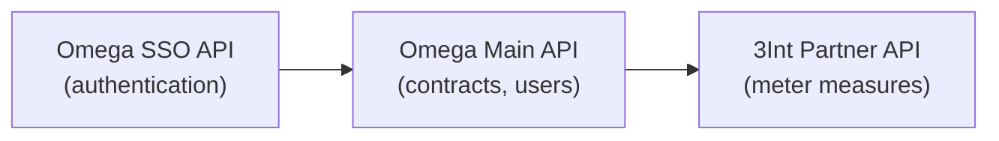
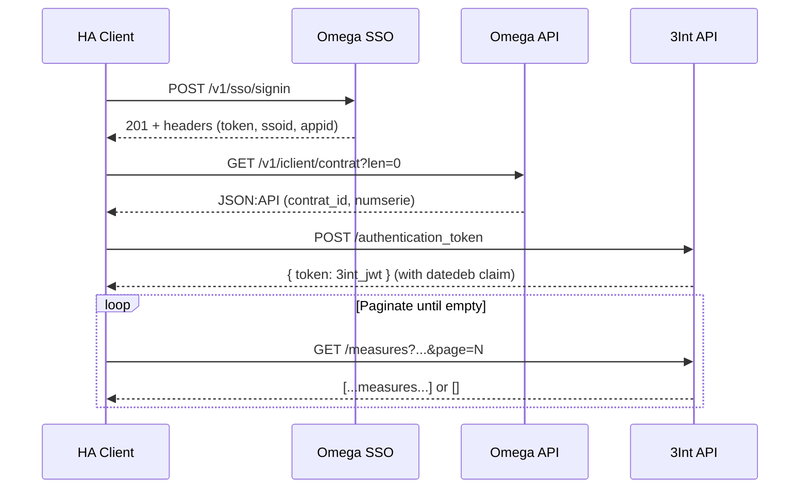
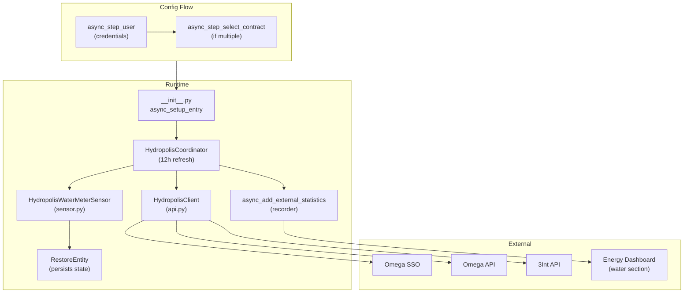
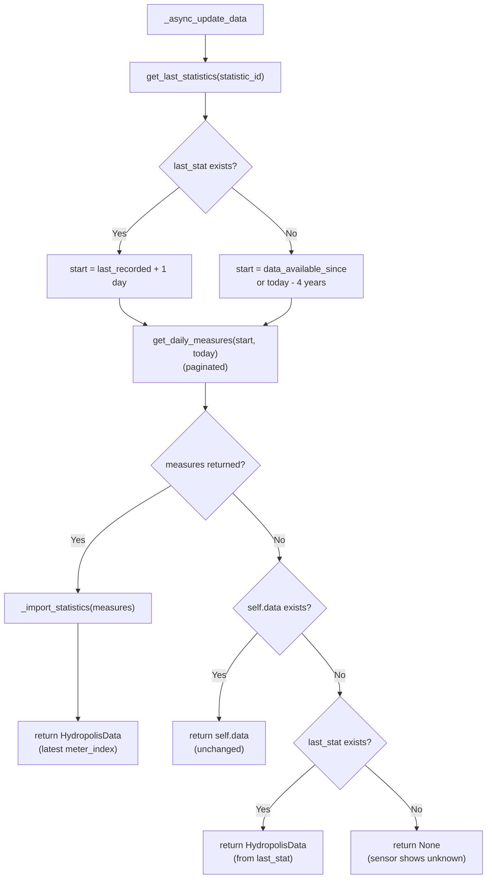
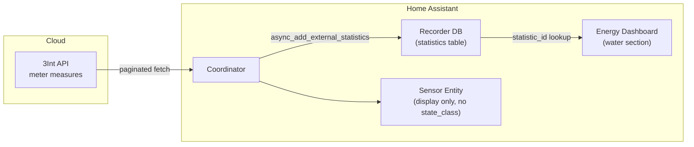

# Hydropolis Valbonne -- Full Rebuild Specification

A complete blueprint for building a Home Assistant (HACS) custom component that
fetches water meter readings from the SPL Hydropolis utility (serving
Valbonne / Sophia Antipolis, France) and integrates them into HA's Energy
dashboard.

---

## Table of Contents

1. [Goal](#1-goal)
2. [Reverse-Engineered API Architecture](#2-reverse-engineered-api-architecture)
3. [Authentication Flow](#3-authentication-flow)
4. [Data Model](#4-data-model)
5. [Home Assistant Integration Architecture](#5-home-assistant-integration-architecture)
6. [Critical Design Decisions and Pitfalls](#6-critical-design-decisions-and-pitfalls)
7. [Energy Dashboard Integration](#7-energy-dashboard-integration)
8. [Test Strategy](#8-test-strategy)
9. [Project Structure and Dependencies](#9-project-structure-and-dependencies)

---

## 1. Goal

Build a HACS custom component (`hydropolis_valbonne`) that:

- Authenticates against the Hydropolis subscriber portal APIs.
- Auto-discovers the user's water contract(s) (no hardcoded `contrat_id`).
- Fetches cumulative water meter readings (liters) from the utility's cloud.
- Imports **all available history** into HA long-term statistics on first run,
  then incrementally fetches only new data on subsequent refreshes.
- Exposes a sensor entity showing the current meter total.
- Works in the **Energy dashboard** (water section) using external statistics.

---

## 2. Reverse-Engineered API Architecture

The Hydropolis subscriber portal (`https://abonnes.hydropolis-sophia.fr`) is a
Single Page Application (Backbone.js + jQuery + Handlebars) that talks to three
chained back-end APIs, all operated by **JVS-Mairistem**:



### 2.1 Omega SSO API

| Property    | Value                                    |
|-------------|------------------------------------------|
| Base URL    | `https://omegasso.jvsonline.fr/api`      |
| Purpose     | User authentication (email + password)   |
| Content-Type| `application/vnd.api+json` (JSON:API)    |

**Login endpoint:**

```
POST /v1/sso/signin
Content-Type: application/vnd.api+json
Accept: application/vnd.api+json

{
  "login": "<email>",
  "password": "<password>",
  "remember": false
}
```

**Success response (HTTP 201):**

The JWT token and session identifiers are returned as **response headers**,
not in the body:

| Header          | Purpose                                     |
|-----------------|---------------------------------------------|
| `authorization` | Bearer JWT token for Omega API calls        |
| `ssoid`         | SSO session identifier                      |
| `appid`         | Application identifier                      |

All three must be captured and forwarded to subsequent Omega API calls.

**Failure:** HTTP status != 201 (typically 401).

### 2.2 Omega Main API

| Property    | Value                                              |
|-------------|----------------------------------------------------|
| Base URL    | `https://omegaweb.jvsonline.fr/api`                |
| Purpose     | Contract management, user data                     |
| Content-Type| `application/vnd.api+json` (JSON:API)              |
| ApiId       | `c49de86f84611ff40ef7b2af822a8614@iclient-hydropolis` |

**Required headers for all calls:**

```
Content-Type: application/vnd.api+json
Accept: application/vnd.api+json
Authorization: Bearer <omega_token>
ApiId: c49de86f84611ff40ef7b2af822a8614@iclient-hydropolis
SsoId: <ssoid from login>
AppId: <appid from login>
```

Without `ApiId`, `SsoId`, and `AppId`, the contracts endpoint returns `data: []`.

**Contracts endpoint:**

```
GET /v1/iclient/contrat?len=0
```

Returns a JSON:API response with:
- `data[]` -- array of contract objects with `attributes.contrat_id`,
  `attributes.numcontrat`, `attributes.pconso_id`, `attributes.actif`
- `included[]` -- related resources:
  - Type `IClient_Compteur` -- meter info, contains `attributes.numserie`
    (the serial number needed for 3Int API)
  - Type `IClient_Voie` -- address info, contains `attributes.libvoie`

### 2.3 3Int Partner API

| Property    | Value                                           |
|-------------|-------------------------------------------------|
| Base URL    | `https://api2.hydropolis-sophia.fr/api`         |
| Purpose     | Water meter measures (daily + hourly index)     |
| Content-Type| `application/json`                              |
| ApiId       | Same as Omega (`c49de86f84611ff40ef7b2af822a8614@iclient-hydropolis`) |

**Token exchange endpoint:**

```
POST /authentication_token
Content-Type: application/json

{
  "jvstoken": "<omega_authorization_header_value>",
  "ApiId": "<THREINT_API_ID>",
  "serial": "<compteur_numserie>",
  "contrat_id": "<contrat_id>"
}
```

Returns `{ "token": "<3int_jwt>" }`.

The 3Int JWT payload contains a `datedeb` claim (ISO date string) indicating
the **earliest date with available data** for this contract. Parse it by
base64-decoding the JWT payload segment.

**Measures endpoint:**

```
GET /measures?dateStatement[after]=YYYY-MM-DDT00:00:00&dateStatement[before]=YYYY-MM-DDT23:59:59&order[dateStatement]=asc&page=N
Authorization: Bearer <3int_jwt>
```

Returns a JSON array (not JSON:API) of measure objects:

```json
[
  {
    "id": 12345,
    "dateStatement": "2025-03-15T23:59:00+01:00",
    "consumption": 234,
    "lastIndex": {
      "Value": 2137684
    },
    "hourlyIndex": [
      {"RangId": 1, "TimeStamp": "...", "Value": 2137500},
      ...
    ]
  }
]
```

| Field                | Meaning                                    |
|----------------------|--------------------------------------------|
| `dateStatement`      | ISO 8601 timestamp of the measurement day  |
| `consumption`        | Daily water usage delta in **liters**       |
| `lastIndex.Value`    | Cumulative meter reading in **liters**      |
| `hourlyIndex[].Value`| Hourly cumulative readings                 |

#### Pagination

The 3Int API paginates at approximately **365 items per page**. The `page=N`
query parameter (1-based) controls which page is returned. When a page returns
an empty array `[]`, there are no more pages.

**You MUST paginate.** Fetching only page 1 will silently return only the
oldest ~365 records for multi-year ranges, giving stale meter readings.

#### Re-authentication

If the measures endpoint returns HTTP 401, the 3Int token has expired. Clear
both the Omega token and the 3Int token and re-authenticate from scratch
(Omega SSO login -> 3Int token exchange -> retry the measures call).

---

## 3. Authentication Flow



Summary:

1. **SSO Login** -- `POST /v1/sso/signin` with email/password. Extract
   `authorization`, `ssoid`, `appid` from response headers.
2. **Fetch contracts** -- `GET /v1/iclient/contrat?len=0` with all four
   headers (`Authorization`, `ApiId`, `SsoId`, `AppId`). Parse `contrat_id`
   and `compteur_numserie` from JSON:API `data` + `included`.
3. **3Int token exchange** -- `POST /authentication_token` with the Omega JWT,
   serial number, and contract ID. Receive a 3Int-specific JWT.
4. **Fetch measures** -- `GET /measures?...&page=N` with the 3Int JWT.
   Paginate until empty response.

---

## 4. Data Model

### HydropolisContract

Extracted from the Omega contracts endpoint:

| Field               | Type        | Source                                    |
|---------------------|-------------|-------------------------------------------|
| `contrat_id`        | `str`       | `data[].attributes.contrat_id`            |
| `numcontrat`        | `str`       | `data[].attributes.numcontrat`            |
| `pconso_id`         | `str`       | `data[].attributes.pconso_id`             |
| `compteur_numserie` | `str`       | `included[type=IClient_Compteur].attributes.numserie` |
| `actif`             | `bool`      | `data[].attributes.actif == "1"`          |
| `address`           | `str\|None` | `included[type=IClient_Voie].attributes.libvoie` |

### DailyMeasure

Extracted from each item in the 3Int `/measures` response:

| Field                | Type       | Source                          |
|----------------------|------------|---------------------------------|
| `date`               | `date`     | `dateStatement` parsed to date  |
| `timestamp`          | `datetime` | `dateStatement` parsed fully    |
| `consumption_liters` | `int`      | `consumption` field             |
| `meter_index`        | `int`      | `lastIndex.Value` field         |

`meter_index` is the **cumulative total** (ever-increasing). This is the value
used for HA statistics and the sensor's native value.

`consumption_liters` is the daily delta. Used only for filtering
(skip negative values) and logging.

---

## 5. Home Assistant Integration Architecture

### 5.1 Component Overview



### 5.2 File Layout

```
custom_components/hydropolis_valbonne/
├── __init__.py          # Entry point: setup/unload config entries
├── api.py               # HydropolisClient: all API interaction
├── config_flow.py       # Two-step config flow (credentials + contract)
├── const.py             # Constants: DOMAIN, URLs, API IDs, intervals
├── coordinator.py       # DataUpdateCoordinator + statistics import
├── sensor.py            # Sensor entity with RestoreEntity
├── manifest.json        # HA component metadata
├── strings.json         # Translatable strings
└── translations/
    └── en.json          # English translations
```

### 5.3 Constants (`const.py`)

| Constant               | Value                                                               |
|------------------------|---------------------------------------------------------------------|
| `DOMAIN`               | `"hydropolis_valbonne"`                                             |
| `CONF_CONTRAT_ID`      | `"contrat_id"`                                                      |
| `DATA_REFRESH_INTERVAL`| `timedelta(hours=12)`                                               |
| `OMEGA_SSO_URL`        | `"https://omegasso.jvsonline.fr/api"`                               |
| `OMEGA_API_URL`        | `"https://omegaweb.jvsonline.fr/api"`                               |
| `OMEGA_API_ID`         | `"c49de86f84611ff40ef7b2af822a8614@iclient-hydropolis"`             |
| `THREINT_API_URL`      | `"https://api2.hydropolis-sophia.fr/api"`                           |
| `THREINT_API_ID`       | Same as `OMEGA_API_ID`                                              |

### 5.4 Config Flow (`config_flow.py`)

Two-step flow:

1. **`async_step_user`** -- Collects `username` (email) and `password`.
   Authenticates via `HydropolisClient.authenticate()` and fetches contracts.
   - If exactly 1 contract: creates the entry directly.
   - If multiple contracts: proceeds to step 2.
2. **`async_step_select_contract`** -- Dropdown of discovered contracts.
   User picks one, entry is created.

The config entry stores:
```python
{
    CONF_USERNAME: str,
    CONF_PASSWORD: str,
    CONF_CONTRAT_ID: str,
    "compteur_numserie": str,
}
```

`unique_id` is set to `contrat_id` so duplicates are detected via
`_abort_if_unique_id_configured()`.

**Pitfall:** `AbortFlow` (raised by `_abort_if_unique_id_configured`) must be
explicitly caught and re-raised before any generic `except Exception` block,
or the abort will be swallowed and the flow will show a form instead.

### 5.5 Coordinator (`coordinator.py`)

`HydropolisCoordinator` extends `DataUpdateCoordinator[HydropolisData | None]`.

**Incremental fetch logic in `_async_update_data`:**



Summary of the steps:

1. Query `get_last_statistics` for the most recent recorded statistic
   (by `statistic_id`).
2. If a last stat exists: `start = last_recorded_date + 1 day`.
3. If no last stat (first run): `start = client.data_available_since`
   (from the 3Int JWT `datedeb` claim), or fall back to `today - 4 years`.
4. Fetch measures from `start` to `today` (with full pagination).
5. If measures are returned: import them as statistics, return the latest
   reading as `HydropolisData`.
6. If no measures are returned:
   - If `self.data` is not None (previous successful fetch): return it unchanged.
   - If `self.data` is None but `last_stat` exists: reconstruct `HydropolisData`
     from the last statistic (graceful restart).
   - If truly nothing: return `None` (sensor shows "unknown", but integration
     loads successfully -- no `UpdateFailed`).

**Statistics import (`_import_statistics`):**

Uses `async_add_external_statistics` (NOT `async_import_statistics`) with:
- `source = DOMAIN` (custom external source)
- `statistic_id = f"{DOMAIN}:{contrat_id}_water_meter"` (deterministic)
- `unit_of_measurement = UnitOfVolume.LITERS`
- `unit_class = VolumeConverter.UNIT_CLASS`
- `has_sum = True`
- `mean_type = StatisticMeanType.NONE`

Each `StatisticData` entry:
- `start` = `dt_util.start_of_local_day(measure.date)` (real measurement date)
- `state` = `float(measure.meter_index)` (cumulative total)
- `sum` = `float(measure.meter_index)` (cumulative total)

### 5.6 Sensor (`sensor.py`)

`HydropolisWaterMeterSensor` inherits from:
- `CoordinatorEntity[HydropolisCoordinator]`
- `RestoreEntity`
- `SensorEntity`

Key attributes:
- `device_class = SensorDeviceClass.WATER`
- `native_unit_of_measurement = UnitOfVolume.LITERS`
- `suggested_display_precision = 0`
- `translation_key = "water_meter"`
- **NO `state_class`** (intentionally omitted -- see Section 6)

**State restoration:**

A custom `HydropolisExtraStoredData(ExtraStoredData)` dataclass persists
`native_value` (int) and `last_measurement` (ISO string) across HA restarts.

The `native_value` property checks in order:
1. `coordinator.data` (live data from API)
2. `_restored_data` (persisted from last shutdown)
3. `None` (unknown)

The `extra_state_attributes` dict contains `last_measurement` (ISO timestamp
of the most recent API measurement).

### 5.7 Entry Setup (`__init__.py`)

```python
async def async_setup_entry(hass, entry):
    coordinator = HydropolisCoordinator(hass, entry)
    await coordinator.async_config_entry_first_refresh()
    entry.runtime_data = coordinator
    await hass.config_entries.async_forward_entry_setups(entry, [Platform.SENSOR])
    return True
```

The coordinator's `_async_setup` (called automatically by
`async_config_entry_first_refresh`) creates the `HydropolisClient` and
authenticates. If credentials are invalid, `ConfigEntryError` is raised.

### 5.8 Manifest (`manifest.json`)

```json
{
  "domain": "hydropolis_valbonne",
  "name": "Hydropolis Valbonne",
  "config_flow": true,
  "dependencies": ["recorder"],
  "iot_class": "cloud_polling",
  "requirements": []
}
```

`dependencies: ["recorder"]` is required because the coordinator imports
statistics via the recorder component.

---

## 6. Critical Design Decisions and Pitfalls

### 6.1 No `state_class` on the Sensor

**Problem:** If the sensor has `state_class = SensorStateClass.TOTAL_INCREASING`,
HA's recorder automatically generates statistics from entity state changes. These
auto-generated statistics are timestamped with the moment HA processes them
("now"), not the actual measurement date from the API. Since the API data is
typically 1-3 days behind, this creates:
- Statistics at the wrong timestamps.
- Double-counting when we also import correctly-timestamped external statistics.
- Corrupted Energy dashboard totals.

**Solution:** Omit `state_class` entirely. The sensor displays the value but
does not trigger auto-generated statistics. All statistics come exclusively
from `async_add_external_statistics` with real measurement dates.

### 6.2 `async_add_external_statistics` vs `async_import_statistics`

**Problem:** `async_import_statistics` validates that `statistic_id` matches
an entity ID format (`domain.object_id`). External statistics use a different
format (`domain:identifier`), causing `ConfigEntryNotReady: Invalid statistic_id`.

**Solution:** Use `async_add_external_statistics`, which accepts and validates
the `domain:identifier` format correctly.

### 6.3 Deterministic `statistic_id`

**Problem:** If the `statistic_id` depends on the entity registry (i.e., the
actual entity ID), there's a timing issue: statistics may be imported before
the sensor entity is registered, and the entity ID may not match what you
expect (HA strips the domain from the device name).

**Solution:** Use a deterministic format that doesn't depend on entity
registration: `f"{DOMAIN}:{contrat_id}_water_meter"`. This can be computed
at coordinator init time, before any entity exists.

### 6.4 Both `state` and `sum` Set to `meter_index`

In `StatisticData`, both `state` and `sum` are set to the cumulative meter
reading (`meter_index`). The Energy dashboard uses `sum` to compute
consumption deltas between periods. Since `meter_index` is already a
monotonically increasing cumulative total, `sum = meter_index` gives correct
deltas: `consumption_day_N = sum_N - sum_(N-1)`.

Setting `state` to `consumption_liters` (daily delta) was an early mistake
that showed daily usage in the history graph instead of a growing counter.

### 6.5 API Pagination is Mandatory

The 3Int `/measures` endpoint caps responses at ~365 items per page. Without
pagination, a multi-year history fetch silently returns only the oldest 365
records, making the "latest" reading actually be ~1 year old. Always iterate
`page=1, 2, ...` until an empty response is received.

### 6.6 Graceful "No Data" Handling

The API legitimately returns no data when:
- It's early in the day and yesterday's data isn't posted yet.
- The meter hasn't reported recently.

Do NOT raise `UpdateFailed` for this case. Instead, return `None` from
`_async_update_data` so the integration loads successfully and the sensor
can display its restored state. Only raise `UpdateFailed` for actual API
errors (network failures, auth errors).

### 6.7 `AbortFlow` Must Be Re-Raised

In the config flow's `async_step_user`, if there's a generic
`except Exception` block for error handling, `AbortFlow` (raised by
`_abort_if_unique_id_configured()`) will be caught by it. The flow will
show a form with an "unknown" error instead of aborting.

Fix: add `except AbortFlow: raise` before `except Exception`.

### 6.8 3Int Token Expiry and Re-Authentication

When the 3Int measures endpoint returns HTTP 401, both the 3Int token AND
the Omega SSO token should be invalidated, then the full authentication
chain re-executed. The Omega token may also have expired by the time the
3Int token does, so re-authenticating only with 3Int is insufficient.

### 6.9 JSON:API Content-Type

The Omega SSO and Omega Main APIs require `Content-Type: application/vnd.api+json`.
Using `application/json` results in HTTP 415 (Unsupported Media Type).
The 3Int API uses plain `application/json`.

---

## 7. Energy Dashboard Integration

### How It Works



The Energy dashboard's water section accepts **external statistics** as data
sources. When configuring the dashboard, the user selects a `statistic_id`
(not an entity) for the water source.

The statistic `hydropolis_valbonne:<contrat_id>_water_meter` will appear in
the Energy dashboard's water source picker because:

1. It has `unit_of_measurement = UnitOfVolume.LITERS` (a recognized water unit).
2. It has `has_sum = True` (required for consumption calculations).
3. It uses `source = DOMAIN` (custom external source, not "recorder").

### Consumption Calculation

The Energy dashboard computes consumption as the **difference in `sum`**
between consecutive time periods. Since `sum` is set to the cumulative
`meter_index`, the delta between two consecutive entries equals the daily
water consumption for that period.

### No Entity `state_class` Needed

The Energy dashboard does NOT require the sensor entity to have a
`state_class`. It consumes statistics directly by `statistic_id`. The sensor
entity exists only for UI display of the current reading; the dashboard reads
from the statistics table.

---

## 8. Test Strategy

### 8.1 Framework

- **`pytest`** with **`pytest-asyncio`** (`asyncio_mode = auto`)
- **`pytest-homeassistant-custom-component`** -- provides the `hass` fixture
  (in-memory HA instance), `recorder_mock`, `MockConfigEntry`,
  `enable_custom_integrations`, etc.
- **`pytest-socket`** -- blocks real network access by default (installed as
  a dependency of `pytest-homeassistant-custom-component`)
- **`python-dotenv`** -- loads credentials from `.env` for live API tests
- **`syrupy`** -- snapshot testing (available but not currently used)

### 8.2 Fixture Architecture (`conftest.py`)

| Fixture                          | Purpose                                          |
|----------------------------------|--------------------------------------------------|
| `auto_enable_custom_integrations`| Autouse; initializes `recorder_mock` then enables custom integrations. `recorder_mock` **must** come first. |
| `fake_contract`                  | A `HydropolisContract` with predictable test values |
| `fake_measures`                  | A list of 5 `DailyMeasure` objects with increasing `meter_index` |
| `mock_config_entry`              | A `MockConfigEntry` added to hass with fake credentials |
| `mock_hydropolis_client`         | Patches `HydropolisClient` in both `coordinator` and `config_flow` modules; returns an `AsyncMock` that provides `authenticate`, `get_contracts`, `get_daily_measures`, and `data_available_since` |

### 8.3 Test Suites

**`test_config_flow.py`** -- Config flow tests:
- Shows user form on first init
- Invalid auth shows error
- Connection error shows error
- No contracts shows error
- Single contract creates entry directly
- Multiple contracts shows select step, then creates entry
- Duplicate contract aborts

**`test_coordinator.py`** -- Coordinator tests:
- First refresh fetches full history
- No measures on first run loads gracefully (data = None, state = LOADED)
- No new measures keeps previous data
- API error sets `last_update_success = False`
- Statistic ID uses external format (`domain:identifier`)
- Incremental refresh works with new data

**`test_sensor.py`** -- Sensor entity tests:
- State value matches latest `meter_index`
- `last_measurement` attribute present and correct
- `device_class` is `WATER`
- No `state_class` attribute
- `unit_of_measurement` is `LITERS`
- Entity ID follows expected pattern

**`test_api.py`** -- Live API tests (skipped without credentials):
- Authentication success and failure
- Contract discovery
- Daily measures fetch
- `data_available_since` parsed from JWT
- Re-authentication after token invalidation
- Pagination fetches all pages (>365 measures for 2-year range)

### 8.4 Live API Tests and `pytest-socket`

`pytest-homeassistant-custom-component` installs a `pytest_runtest_setup` hook
that globally disables real network sockets via `pytest-socket`. Live API tests
need actual network access.

**Workaround:** Override the `auto_enable_custom_integrations` fixture in
`test_api.py` with a local `autouse` fixture that restores the real socket:

```python
import pytest_socket
import socket as socket_mod

@pytest.fixture(autouse=True)
def auto_enable_custom_integrations():
    real_socket = pytest_socket._true_socket
    real_connect = pytest_socket._true_connect
    socket_mod.socket = real_socket
    socket_mod.socket.connect = real_connect
    yield
```

### 8.5 Credentials Management

Live API tests require real Hydropolis credentials. These are loaded from a
`.env` file (git-ignored) via `python-dotenv`:

```
HYDROPOLIS_USERNAME=your_email@example.com
HYDROPOLIS_PASSWORD=your_password_here
```

Tests are skipped when credentials are absent (`@pytest.mark.skipif`).

---

## 9. Project Structure and Dependencies

### 9.1 Repository Layout

```
hacs-hydropolis-valbonne/
├── custom_components/
│   ├── __init__.py                          # Empty (required for pytest discovery)
│   └── hydropolis_valbonne/
│       ├── __init__.py                      # HA entry point
│       ├── api.py                           # API client
│       ├── config_flow.py                   # Config flow
│       ├── const.py                         # Constants
│       ├── coordinator.py                   # Data coordinator + statistics
│       ├── sensor.py                        # Sensor entity
│       ├── manifest.json                    # HA metadata
│       ├── strings.json                     # i18n strings
│       └── translations/
│           └── en.json                      # English translations
├── tests/
│   ├── __init__.py                          # Empty (package marker)
│   ├── conftest.py                          # Shared fixtures
│   ├── test_api.py                          # Live API tests
│   ├── test_config_flow.py                  # Config flow tests
│   ├── test_coordinator.py                  # Coordinator tests
│   └── test_sensor.py                       # Sensor tests
├── .env.example                             # Credentials template
├── .gitignore                               # Standard Python + .env + venv
├── hacs.json                                # HACS metadata
├── pytest.ini                               # asyncio_mode=auto, testpaths=tests
├── requirements.txt                         # Runtime deps (for dev env)
├── requirements_test.txt                    # Test deps
└── README.md                                # Project documentation
```

### 9.2 Runtime Dependencies (`requirements.txt`)

```
homeassistant>=2024.1.0
aiohttp>=3.8.0
voluptuous>=0.13.0
```

These are for the development virtual environment only. The `manifest.json`
has `"requirements": []` because `aiohttp` and `voluptuous` are already
provided by Home Assistant at runtime.

### 9.3 Test Dependencies (`requirements_test.txt`)

```
pytest>=7.0.0
pytest-asyncio>=0.21.0
pytest-cov>=4.0.0
pytest-timeout>=2.1.0
pytest-homeassistant-custom-component>=0.13.160
python-dotenv>=1.0.0
syrupy>=4.6.0
```

### 9.4 HACS Configuration (`hacs.json`)

```json
{
  "name": "Hydropolis Valbonne",
  "render_readme": true
}
```

### 9.5 Development Environment Setup

```bash
python3.14 -m venv venv
source venv/bin/activate
pip install -r requirements.txt
pip install -r requirements_test.txt
```

### 9.6 Running Tests

```bash
# All tests (excluding live API tests if no .env)
pytest

# With coverage
pytest --cov=custom_components.hydropolis_valbonne

# Only live API tests
pytest tests/test_api.py -v
```

---

## Appendix: Translatable Strings

### `strings.json` / `translations/en.json`

Both files have identical content:

- **Config steps:** `user` (login form), `select_contract` (contract picker)
- **Errors:** `invalid_auth`, `cannot_connect`, `no_contracts`, `unknown`
- **Abort reasons:** `already_configured`
- **Entity names:** `sensor.water_meter` -> "Water meter"

---

## Appendix: Home Assistant Brands

For a PR to `home-assistant/brands`, prepare:

```
custom_integrations/hydropolis_valbonne/
├── icon.png      # 256x256 square
└── icon@2x.png   # 512x512 square
```

Source the icon from `https://www.hydropolis-sophia.fr` favicon or logo.
The `logo.png` / `logo@2x.png` files are optional; the icon serves as fallback.
